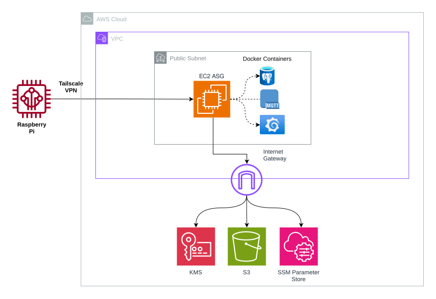

# humidity-sensor
A homelab project for a near-real-time streaming pipeline for temperature and humidity data collected from a Raspberry Pi with an Adafruit BME280 sensor. Built as a proof of concept and learning exercise, spanning a local prototype and a cloud-hosted AWS deployment.

Desired analytics insights:
* Temperature and humidity across the course of a day
* Rate of house cooling once heating is turned off in the evening
* Quick lookup of internal temperature and rate of heating

## Architecture


1. **Sensor publisher (Raspberry Pi)**: Python script reads BME280 every _N_ minutes and publishes to Mosquitto over the Tailscale network
2. **EC2 (t3.micro, Amazon Linux 2)**: Runs the full stack via Docker Compose — Tailscale, Mosquitto, Telegraf, TimescaleDB, Grafana
3. **Tailscale**: WireGuard-based overlay network connecting the Pi and EC2; the EC2 has no inbound security group rules — all access is via the tunnel
4. **AWS supporting services**: SSM Parameter Store (secrets), S3 (config files), CloudWatch (container logs)

## Prerequisites
* AWS account with credentials configured locally
* Terraform >= 1.0
* Tailscale account with an API key
* Raspberry Pi with BME280 sensor (I2C)

## Deployment

### 1. Bootstrap (first time only)
The bootstrap module creates the Terraform state bucket and lock table:
```bash
cd terraform/bootstrap
terraform init && terraform apply
```

### 2. Deploy infrastructure
```bash
cd terraform
terraform init
terraform apply -var-file="terraform.tfvars.prod"
```

Terraform provisions: VPC, EC2 ASG, EBS volume, S3 config bucket, SSM secrets, CloudWatch log groups, Tailscale auth key.

The EC2 user-data script runs on first boot: mounts the EBS volume, pulls secrets from SSM, downloads config from S3, and starts Docker Compose.

### 3. Configure the Pi
Copy `pi.env.example` to `pi.env` and fill in credentials:
```
MQTT_USER=<sensor mqtt username>
MQTT_PASSWORD=<sensor mqtt password>
```

Install dependencies:
```bash
pip install -r pi/requirements.txt
```

Run the publisher (once both devices are enrolled in Tailscale):
```bash
python pi/read_bme280.py --hostname humidity-sensor-ec2 --freq 1
```

| Flag | Default | Description |
|------|---------|-------------|
| `--hostname` | `localhost` | MQTT broker hostname or Tailscale name |
| `--freq` | `1` | Readings per minute (1–60) |
| `--port` | `1883` | MQTT port |
| `--topic` | `sensors/indoor` | MQTT topic |
| `--debug` | off | Print readings to stdout |
| `--log-file` | `warnings.log` | File for WARNING+ logs |

## Accessing Grafana
Once both devices are enrolled in Tailscale:
```
http://humidity-sensor-ec2:3000
```
Log in with the `grafana/admin/username` and `grafana/admin/password` values from SSM. Configure a PostgreSQL datasource pointing at `timescaledb:5432`, database `sensors_db`.

## Secrets
All secrets are passed as Terraform variables and stored in SSM Parameter Store. The required variables are:

| Variable | Description |
|----------|-------------|
| `mqtt_sensor_password` | Pi publisher MQTT password |
| `mqtt_telegraf_password` | Telegraf MQTT subscriber password |
| `timescaledb_telegraf_password` | Telegraf DB password |
| `timescaledb_grafana_password` | Grafana DB password |
| `timescaledb_postgres_password` | TimescaleDB admin password |
| `grafana_admin_password` | Grafana admin password |
| `tailscale_api_key` | Tailscale API key |
| `tailnet_domain` | Tailscale tailnet domain |

## Debugging

### Check container logs
```bash
docker logs mosquitto
docker logs telegraf
docker logs timescaledb
docker logs grafana
docker logs tailscale
```

### Mosquitto — verify broker auth
```bash
# Subscribe
mosquitto_sub -h localhost -p 1883 -t 'test/auth' -u 'YOUR_USER' -P 'YOUR_PASS' -v

# Publish
docker exec mosquitto mosquitto_pub -h localhost -p 1883 -t 'test/auth' -m 'hello mqtt' -u 'YOUR_USER' -P 'YOUR_PASS'
```

### Integration test — inject a sensor reading end-to-end
```bash
docker exec mosquitto mosquitto_pub \
  -h localhost -p 1883 \
  -t 'sensors/indoor' \
  -m '{"ts": 1773692061945, "temperature": 25.0, "humidity": 50.0}' \
  -u 'YOUR_USER' -P 'YOUR_PASS'
```

### Telegraf
* Ensure no trailing newline characters in secret files
* Check that Telegraf can reach both `mosquitto` and `timescaledb` by container name

### TimescaleDB
* Verify the init script ran and the schema exists
* Confirm secret files are mounted and readable

## Future Plans
* Visualising rate of evening temperature drop with statistics
* Adding `sensors/outdoor` topic with an outdoor sensor and enclosure
* Enriching the dashboard with weather forecast or historic data
